# 🌱 Carbon Neutrality Dashboard

An intuitive and informative frontend interface designed for monitoring and managing carbon emissions and environmental metrics focusing on coal mine emission visualization and reporting.

> 💻 Built with **React.js** and **Tailwind CSS**

---

## 🌐 Live Preview

**🔗 [Carbon Neutrality](https://carbon-neutrality-e8ha.vercel.app/)**

---

## 🚀 Features

- 📊 Interactive visualizations for emission analytics
- 🏭 Real-time comparison of coal mine data with environmental standards
- 📁 Section-wise dashboard for clear segregation (e.g., Fuel Usage, Emission Analytics, etc.)
- 🧩 Modular and reusable components for scalability
- 💡 Clean and minimal UI with Tailwind CSS utility classes

---

## 📦 Tech Stack

- **Frontend Framework**: React.js
- **Styling**: Tailwind CSS
- **Icons**: Lucide React
- **Charts**: Recharts

---

## 🛠️ Installation & Setup

1. Clone the repository:

       git clone https://github.com/PrajwalWadekar/CarbonNeutrality.git
       cd CarbonNeutrality

2. Install dependencies:

       npm install

3. Start the development server:

       npm run dev

---

## 🖼️ Screenshot

### 📸 Screenshots

---

#### 🏠 Home Page
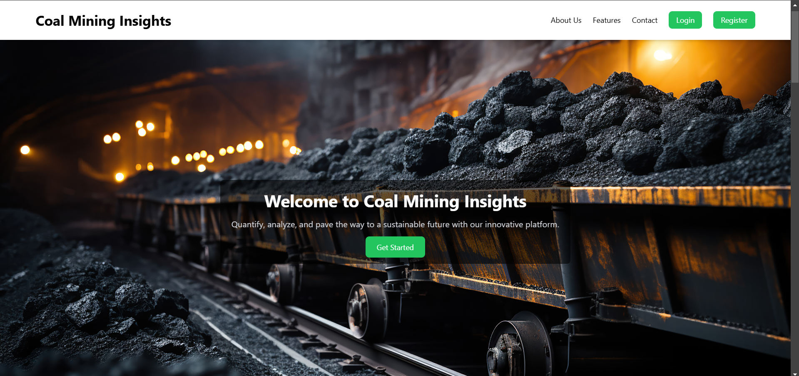

---

### 📝 Data Input Module

#### Step 1: Excavation Data
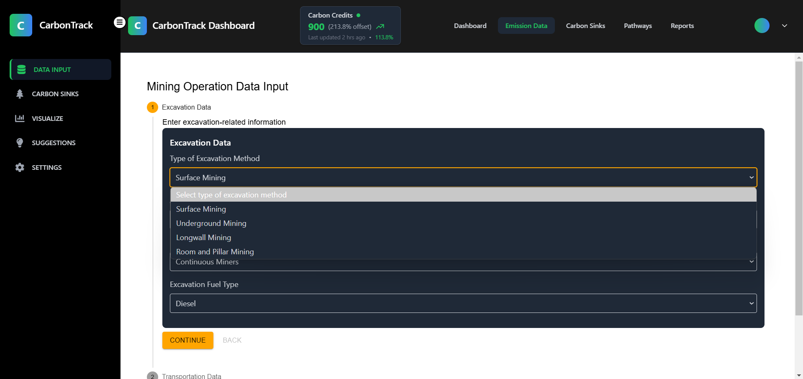

#### Step 2: Transportation Data
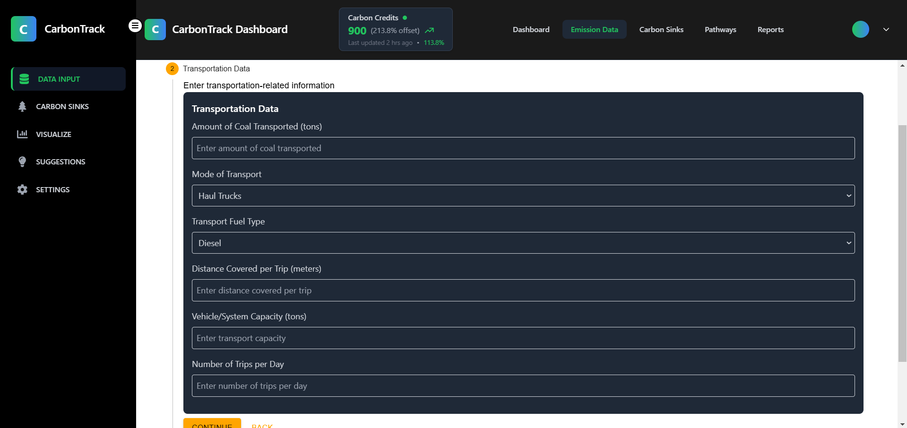

#### Step 3: Equipment Usage
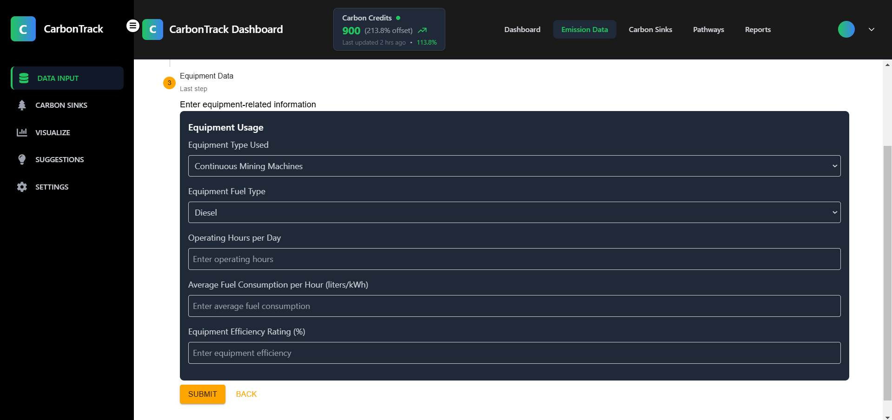

---

### 🌿 Carbon Sink Module

#### Overall Analytics
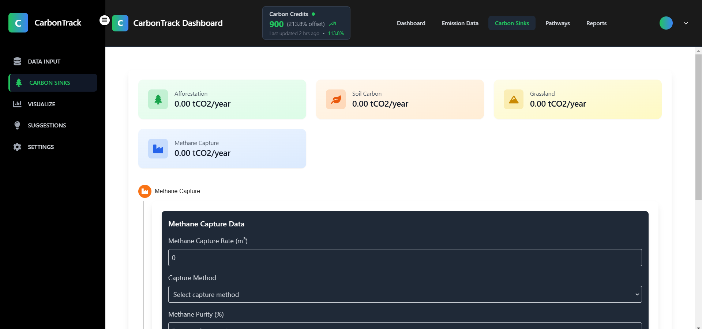

#### Step 1: Methane Capture
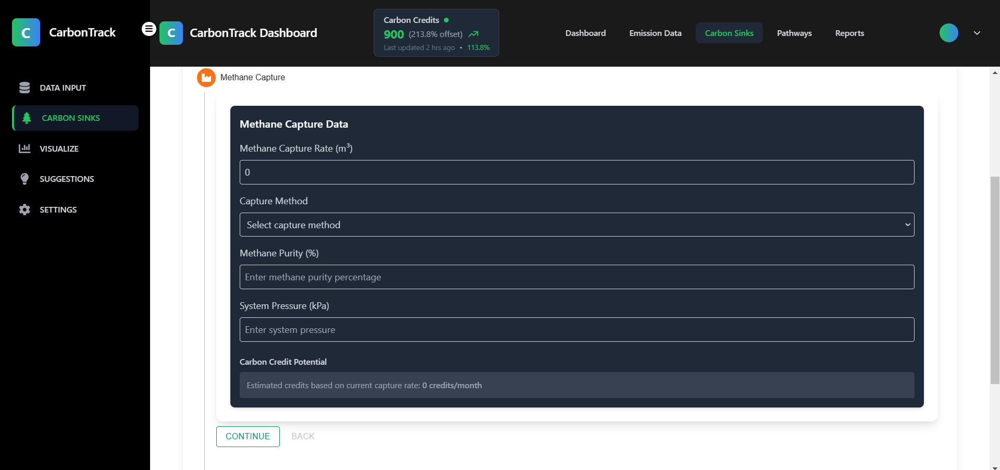

#### Step 2: Afforestation
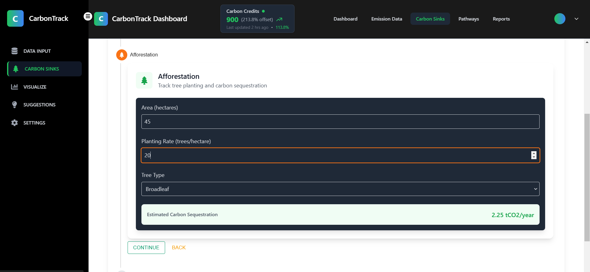

#### Step 3: Soil Carbon Enhancement
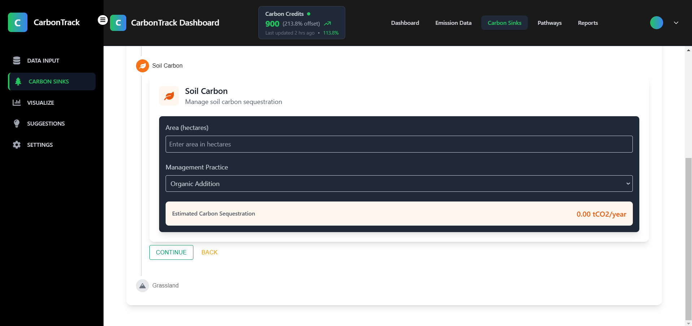

#### Step 4: Grassland Management
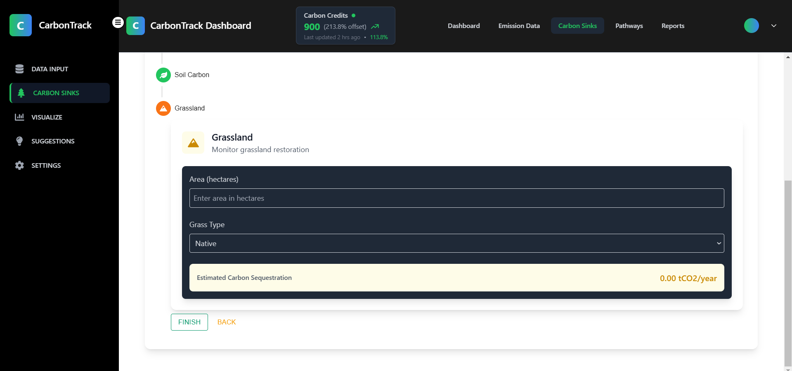

---

### 📈 Visualisation & Analytics

#### Overall Emissions Overview
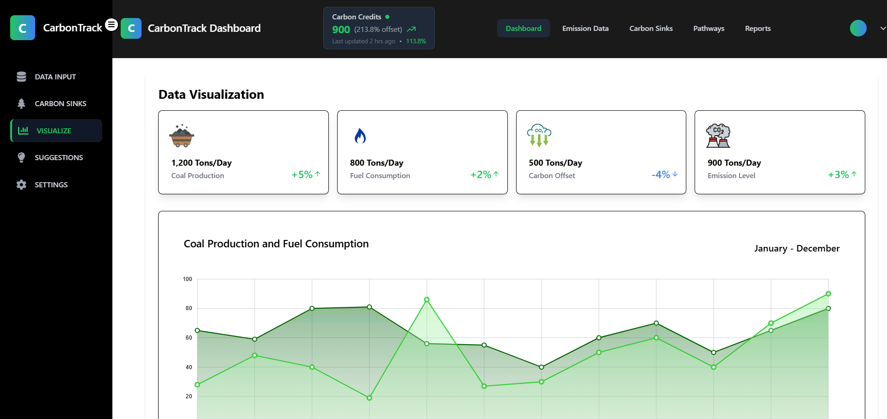

#### Area Chart - Emission Trends
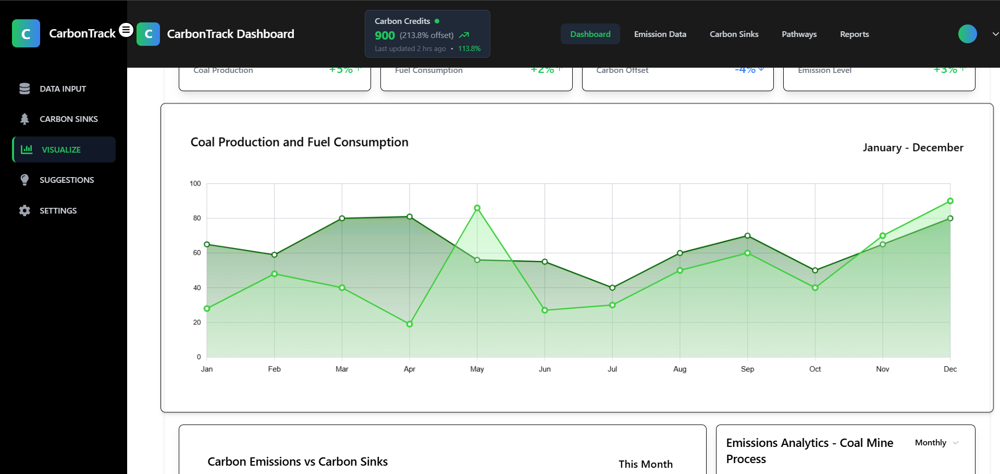

#### Bar & Pie Chart - Emission Categories
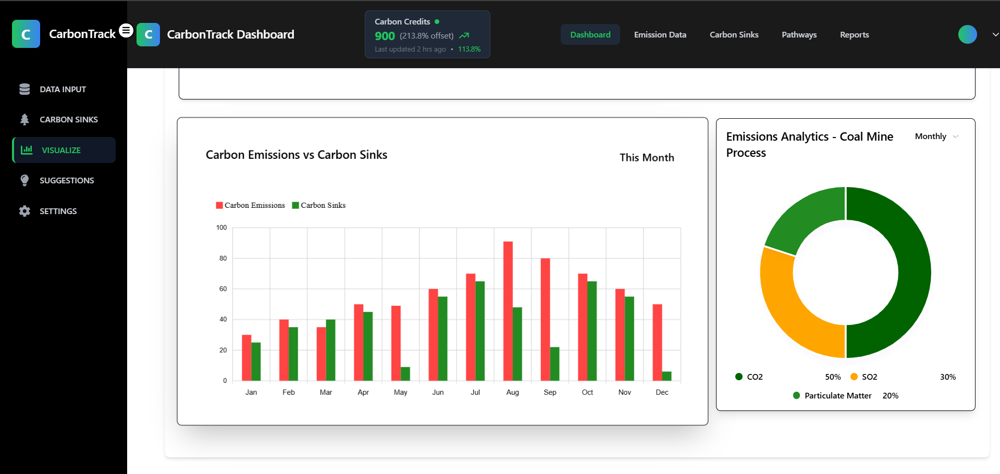

---

### 💡 Suggestions Module
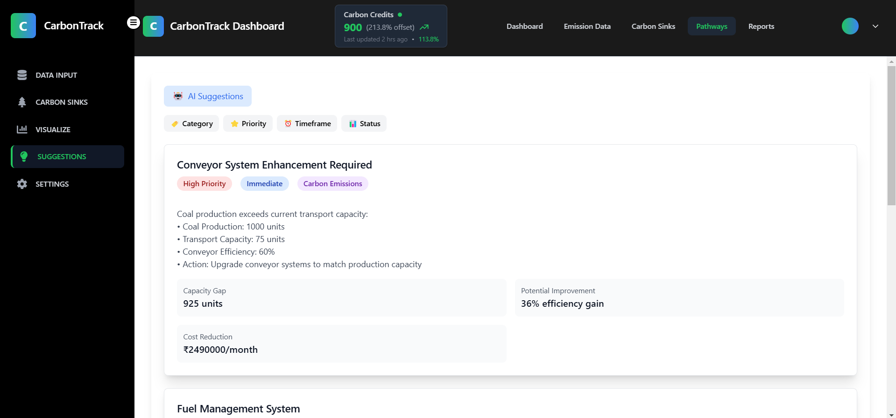

---

### 📊 Reports Section
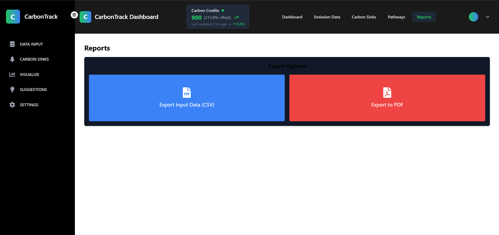
